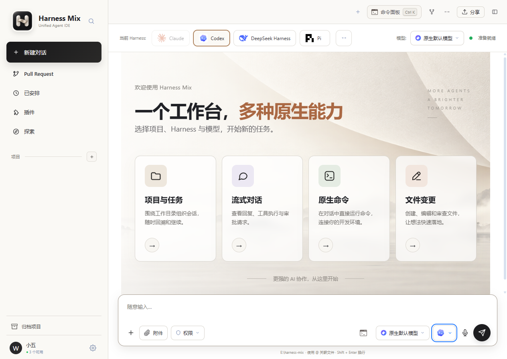
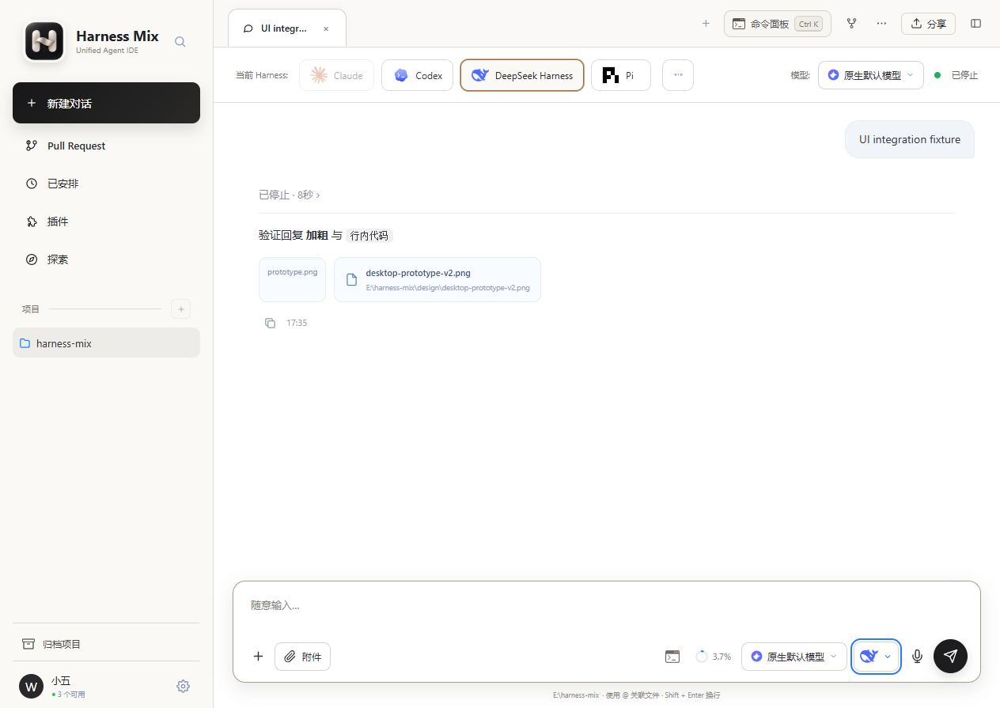
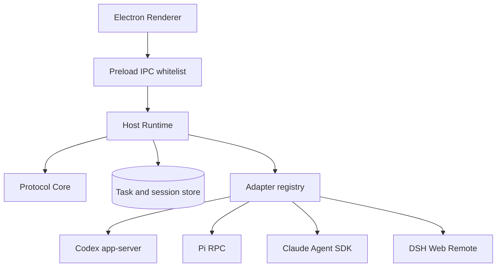

# Harness Mix

<p align="center">
  
</p>

<p align="center"><strong>一个工作台，连接多个原生 Coding Harness。</strong></p>

<p align="center">
  <a href="LICENSE"></a>
  
  
</p>

Harness Mix 是一个独立的 Electron 桌面应用，把 Codex、Pi、Claude Code 和 DeepSeek Harness 放进同一个项目工作台。每个 Harness 仍通过自己的原生协议运行，并继续拥有会话、模型调用、工具、权限和凭据；Harness Mix 负责桌面交互、任务编排和统一事件投影。



## 能做什么

- 在项目下组织、恢复、置顶、编辑、移除和 Fork 会话。
- 流式呈现回答、思考、命令执行、工具调用、文件变更和上下文压缩。
- 调用每个 Harness 原生提供的模型、权限、上下文用量和快捷指令。
- 在任务运行期间查看文件 Diff、Git 状态和终端输出。
- 将审批与提问送回原生 Harness，不代替用户作出权限决定。
- 通过 Adapter 注册新 Harness，Renderer 无需理解厂商协议。



## 原生接入

| Harness | 原生接口 | 当前接入重点 |
| --- | --- | --- |
| Codex | `codex app-server --stdio` | Thread / Turn / Item、流式事件、审批、Usage、Resume、Fork、Compact |
| Pi | `pi --mode rpc` | 会话恢复、模型目录、Usage、原生命令、Fork |
| Claude Code | `@anthropic-ai/claude-agent-sdk` 的 `query()` | 持久会话、流式消息、工具、权限、模型与 Resume |
| DeepSeek Harness | `npm run dsh -- web` | Web Remote、Typert RPC、WebSocket 事件、会话与模型控制 |

能力只在 Adapter 的 `manifest` 中声明。界面根据真实能力显示入口，不靠 Harness 名称猜测功能；厂商特有字段会保留在原生引用和载荷中。

## 架构



```text
src/
├─ main/
│  ├─ adapters/          # 每个 Harness 的原生适配器
│  ├─ harness-adapter/   # Manifest、能力与适配器契约
│  ├─ host/              # 编排、恢复、持久化与事件投影
│  ├─ protocol-core/     # Thread / Turn / Item 统一语义
│  ├─ preload.js         # Renderer 可调用的 IPC 白名单
│  └─ main.js            # Electron 生命周期
└─ renderer/             # 桌面 UI、样式和图标
```

新增 Harness 时，实现同形 Adapter 并注册到 `src/main/adapters/index.js`。核心形态如下：

```js
module.exports = {
  manifest: {
    id,
    name,
    icon,
    capabilities: { streaming, tools, approvals, models, resume, fork, usage }
  },
  create(emit) {
    return {
      inspect,
      open,
      send,
      cancel,
      close,
      respond,
      listModelsFor,
      setModel,
      fork
    };
  }
};
```

## 本地运行

开发环境需要 Windows、近期 Node.js LTS 和 npm。应用不会读取或保存 Harness 的账户密钥，请先在对应的原生 CLI 中完成安装与登录。

```powershell
git clone https://github.com/emo-xiaoyu/harness-mix.git
cd harness-mix
npm install
npm start
```

常用原生依赖：

- Codex：安装 `@openai/codex`，确保 `codex` 命令可用。
- Pi：确保 `pi.cmd` 可用。
- Claude Code：SDK 已由 npm 依赖安装，认证仍由 Claude Code 环境管理。
- DeepSeek Harness：默认查找 `E:\dsh\deepseek-harness`，也可设置 `HARNESS_MIX_DSH_ROOT`。

## 验证

```powershell
npm run check
npm run test:core-all
npm run smoke
npm run smoke:app
```

涉及原生 Adapter 时，再执行对应的真实链路：

```powershell
npm run e2e:pi
npm run e2e:dsh
npm run e2e:claude
npm run e2e:codex
```

部分 E2E 会启动真实 Harness，可能需要本机安装、登录或模型额度。测试生成物写入 `output/`，不应提交到仓库。

## 设计原则

1. **原生能力优先**：Adapter 翻译协议，不重新实现 Harness。
2. **诚实声明能力**：只有完成接线和验证的能力才进入 `manifest`。
3. **惰性恢复**：打开历史任务只读取本地投影，发送新消息时才恢复原生进程。
4. **可回放事件**：Core Event 保持稳定顺序，可用于恢复、投影和确定性校验。
5. **凭据隔离**：账号、令牌、沙箱和权限决定由原生程序管理。

## 项目状态

- [内核迁移状态](CORE-MIGRATION-STATUS.md)
- [下一步计划](NEXT-STEPS.md)
- [设计验收记录](design-qa.md)

Harness Mix 参考了 [codex-host](https://github.com/BytePioneer-AI/codex-host) 的插件化组织方式，并使用 [OpenAI Codex](https://github.com/openai/codex) 官方 app-server 协议完成 Codex 原生接入。

## License

Harness Mix 基于 [Apache License 2.0](LICENSE) 发布。第三方组件仍适用各自的许可证；归属信息见 [NOTICE](NOTICE)。
