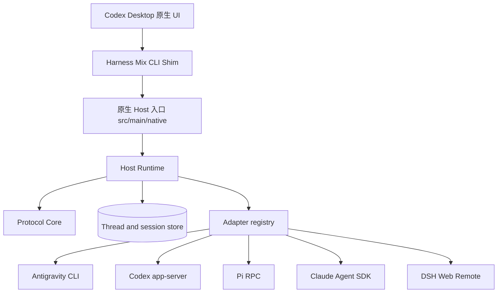

# Harness Mix

<p align="center">
  
</p>

<p align="center"><strong>Codex 原生 UI，连接多个原生 Coding Harness。</strong></p>

<p align="center">
  <a href="LICENSE"></a>
  
  
</p>

Harness Mix 是接入官方 Codex Desktop 原生界面的本地内核：通过本地编译的 CLI Shim 接管桌面的 app-server 协议，把 Pi、Claude Code、DeepSeek Harness、Antigravity 和 Codex 统一进同一套原生 UI。会话生命周期、模型调用、多轮对话、审批与文件差异全部由本仓库的 Host Runtime + Protocol Core + 原生适配器管理；凭据与权限决定仍属于各原生 Harness。


## 能做什么

- 在 Codex Desktop 原生输入框中选择 Harness 并发起会话。
- 流式呈现回答、思考、命令执行、工具调用、文件变更和上下文压缩。
- 调用每个 Harness 原生提供的模型、权限、上下文用量和快捷指令。
- 原生 Diff、审批与提问组件直接渲染，审批路由回原生 Harness，不代替用户作出权限决定。
- 通过 Adapter 注册新 Harness，UI 侧无需理解厂商协议。


## 原生接入

通过 Codex Desktop 内的 Harness 选择器统一查看连接、筛选模型和保存每个 Harness 的新对话默认模型。具体流程与原生边界见 [Harness 管理说明](docs/harness-management.md)。

| Harness | 原生接口 | 当前接入重点 |
| --- | --- | --- |
| Antigravity | `agy` CLI (`stream-json` / PreToolUse Hook) | 流式输出、Gemini 模型目录与思考档位、Desktop 审批与提问桥接、文件变更、配额查询与 Fork |
| Codex | `codex app-server --stdio` | Thread / Turn / Item、流式事件、审批、Usage、Resume、Fork、Compact |
| Pi | `pi --mode rpc` | 会话恢复、模型目录、Usage、原生命令、Fork |
| Claude Code | `@anthropic-ai/claude-agent-sdk` 的 `query()` | 持久会话、流式消息、工具、权限、模型与 Resume |
| DeepSeek Harness | `npm run dsh -- web` | Web Remote、Typert RPC、WebSocket 事件、会话与模型控制 |

能力只在 Adapter 的 `manifest` 中声明。界面根据真实能力显示入口，不靠 Harness 名称猜测功能；厂商特有字段会保留在原生引用和载荷中。

## 架构



```text
src/
├─ main/
│  ├─ adapters/          # 每个 Harness 的原生适配器
│  ├─ harness-adapter/   # Manifest、能力与适配器契约
│  ├─ host/              # 编排、恢复、持久化与事件投影
│  ├─ native/            # 原生模式：Launcher、Shim、Host 入口、协议桥
│  └─ protocol-core/     # Thread / Turn / Item 统一语义
├─ native-ui/
│  ├─ renderer-extension/  # 注入 Codex Desktop 的渲染扩展（选择器、模型目录）
│  ├─ desktop-control/     # CDP 控制器与请求桥
│  └─ shared-contracts/    # 渲染侧与内核共享的协议契约
└─ assets/icons/         # Harness 与模型图标（编译期嵌入）
```

新增 Harness 时，实现同形 Adapter 并注册到 `src/main/adapters/index.js`。核心形态如下：

```js
module.exports = {
  manifest: {
    id,
    name,
    icon,
    capabilities: { streaming, tools, approvals, models, resume, fork, usage }
  },
  create(emit) {
    return {
      inspect,
      open,
      send,
      cancel,
      close,
      respond,
      listModelsFor,
      setModel,
      fork
    };
  }
};
```

## 本地运行

开发环境需要 Windows、近期 Node.js LTS 和 npm。应用不会读取或保存 Harness 的账户密钥，请先在对应的原生 CLI 中完成安装与登录。

```powershell
git clone https://github.com/emo-xiaoyu/harness-mix.git
cd harness-mix
npm install
```

### 运行方式

原生模式（默认）：本地编译的 Shim 与 Renderer 扩展接入官方 Codex Desktop，模型选择会路由到对应 Harness。首次启动会重启已打开的 Codex Desktop：
```powershell
npm start
```

常用原生依赖：

- Codex：安装 `@openai/codex`，确保 `codex` 命令可用。
- Pi：确保 `pi.cmd` 可用。
- Claude Code：SDK 已由 npm 依赖安装，认证仍由 Claude Code 环境管理。
- DeepSeek Harness：使用本项目锁定的 `@deepseek-ai/dsh@0.1.2-rc.1`。可通过 `HARNESS_MIX_DSH_ROOT` 显式指定源码目录，但版本必须被内核支持。

原生接入方式、数据目录和验证说明见 [原生 Codex 接入](docs/native-codex.md)。

## 验证

```powershell
npm run check
npm run test:core-all
npm run e2e:native
npm run smoke:native-ui
```

涉及原生 Adapter 时，再执行对应的真实链路：

```powershell
npm run e2e:pi
npm run e2e:dsh
npm run e2e:claude
npm run e2e:codex
```

部分 E2E 会启动真实 Harness，可能需要本机安装、登录或模型额度。测试生成物写入 `output/`，不应提交到仓库。

## 设计原则

1. **原生能力优先**：Adapter 翻译协议，不重新实现 Harness。
2. **诚实声明能力**：只有完成接线和验证的能力才进入 `manifest`。
3. **惰性恢复**：打开历史任务只读取本地投影，发送新消息时才恢复原生进程。
4. **可回放事件**：Core Event 保持稳定顺序，可用于恢复、投影和确定性校验。
5. **凭据隔离**：账号、令牌、沙箱和权限决定由原生程序管理。

## 项目状态

- [内核迁移状态](CORE-MIGRATION-STATUS.md)
- [下一步计划](NEXT-STEPS.md)
- [设计验收记录](design-qa.md)

Harness Mix 参考了 [codex-host](https://github.com/BytePioneer-AI/codex-host) 的插件化组织方式，并使用 [OpenAI Codex](https://github.com/openai/codex) 官方 app-server 协议完成 Codex 原生接入。

## License

Harness Mix 基于 [Apache License 2.0](LICENSE) 发布。第三方组件仍适用各自的许可证；归属信息见 [NOTICE](NOTICE)。
