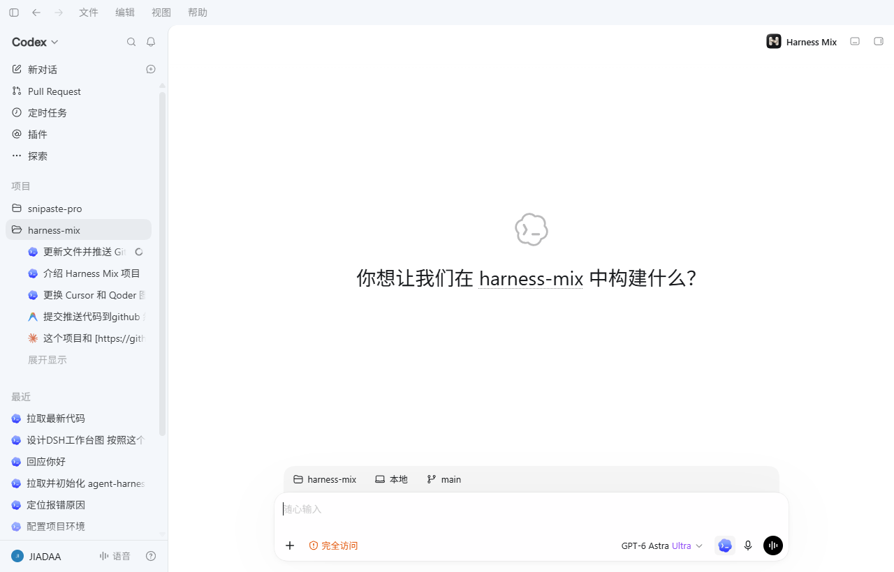
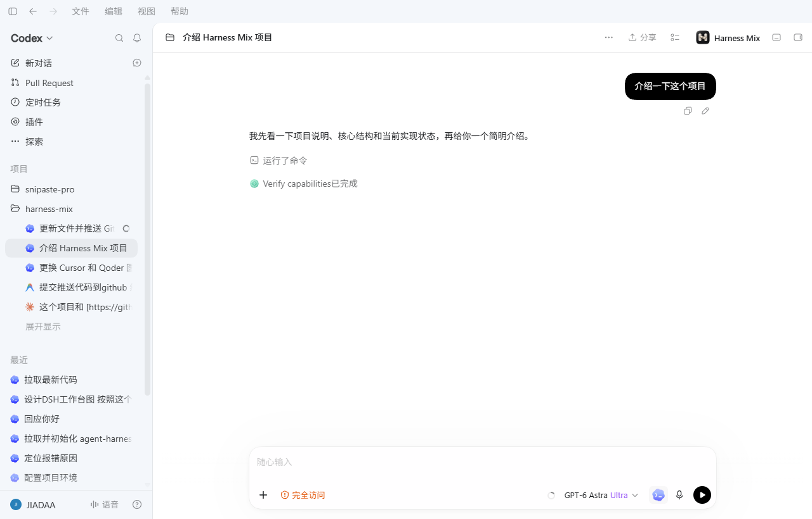
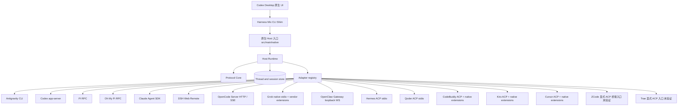

# Harness Mix

<p align="center">
  
</p>

<p align="center">
  ⭐ 如果这个项目对你有帮助，请给我们一个 <a href="https://github.com/emo-xiaoyu/harness-mix">Star</a>！ ⭐
</p>

<p align="center"><strong>Codex 原生 UI，连接多个原生 Coding Harness。</strong></p>

<p align="center">
  <a href="LICENSE"></a>
  
  
</p>

<p align="center"><strong>当前注册的 Harness（16 个）</strong></p>

<table align="center">
  <tbody>
    <tr>
      <td align="center"><br><sub>Antigravity</sub></td>
      <td align="center"><br><sub>Codex</sub></td>
      <td align="center"><br><sub>Claude Code</sub></td>
      <td align="center"><br><sub>Pi</sub></td>
    </tr>
    <tr>
      <td align="center"><br><sub>Oh My Pi</sub></td>
      <td align="center"><br><sub>DeepSeek</sub></td>
      <td align="center"><br><sub>OpenCode</sub></td>
      <td align="center"><br><sub>Grok</sub></td>
    </tr>
    <tr>
      <td align="center"><br><sub>OpenClaw</sub></td>
      <td align="center"><br><sub>Hermes</sub></td>
      <td align="center"><br><sub>Qoder</sub></td>
      <td align="center"><br><sub>CodeBuddy</sub></td>
    </tr>
    <tr>
      <td align="center"><br><sub>Kiro</sub></td>
      <td align="center"><br><sub>Cursor</sub></td>
      <td align="center"><br><sub>ZCode</sub></td>
      <td align="center"><br><sub>Trae</sub></td>
    </tr>
  </tbody>
</table>

<p align="center"><sub>图标与 Harness 能力均来自项目自身的注册表；只有本机已安装且握手成功的 Harness 才会进入真实运行。</sub></p>

Harness Mix 是接入官方 Codex Desktop 原生界面的本地内核。它通过本地编译的 CLI Shim 对接桌面的 app-server 协议，把包括 Antigravity、Codex、Pi、Oh My Pi、Claude Code、DeepSeek Harness、OpenCode、Grok、OpenClaw、Hermes、Qoder、CodeBuddy、Kiro CLI、Cursor CLI、ZCode 和 Trae 在内的原生 Coding Harness 接入同一套 UI。Host Runtime 与 Protocol Core 管理任务映射、协作和事件投影；模型调用、工具执行、原生会话与凭据仍由各 Harness 自己管理。

## 界面预览

<p align="center">
  
</p>

预览来自当前 Codex Desktop 原生窗口：Harness Mix 作为原生扩展入口出现在桌面工具栏和 Composer 中，会话、模型、工具与权限仍由 Codex Desktop 及各 Harness 管理。

## 能做什么

- 在 Codex Desktop 原生输入框中选择 Harness 并发起会话。
- 流式呈现回答、思考、命令执行、工具调用、文件变更和上下文压缩。
- 调用每个 Harness 原生提供的模型、权限、上下文用量和快捷指令。
- 会话中原地切换 Harness（`/switch <Harness 名> [备注]` 或 `codexhost/thread/harness/switch`）：会话历史与文件现场保留在 Host 线程上，切换后首轮自动携带一次性上下文信封；切回旧 Harness 时按其原生机制（Pi `--session` / Claude `resume`）恢复原会话。
- 原生 Diff、审批与提问组件直接渲染，审批路由回原生 Harness，不代替用户作出权限决定。
- CodeBuddy、Kiro 和 Cursor 使用原生 ACP 加厂商专用接口：提问、计划确认、配置确认、取消恢复、上下文与历史按各自协议处理。功能和验证范围见下表，不将通用 ACP 能力视为所有 CLI 都已支持。
- 通过 Adapter 注册新 Harness，UI 侧无需理解厂商协议。

<p align="center">
  
</p>

## 原生接入

通过 Codex Desktop 内的 Harness 选择器统一查看连接、筛选模型和保存每个 Harness 的新对话默认模型。具体流程与原生边界见 [Harness 管理说明](docs/harness-management.md)。

| Harness | 原生接口 | 当前接入重点 |
| --- | --- | --- |
| Antigravity | `agy` CLI (`stream-json` / PreToolUse Hook) | 流式输出、Gemini 模型目录与思考档位、Desktop 审批与提问桥接、文件变更、配额查询与 Fork |
| Codex | `codex app-server --stdio` | Thread / Turn / Item、流式事件、审批、Usage、Resume、Fork、Compact |
| Pi | `pi --mode rpc` | 会话恢复、模型目录、Usage、原生命令、Fork |
| Oh My Pi | `omp --mode rpc`（Pi 家族协议，见 `pi-family.js`） | 与 Pi 同源：会话、模型、思考档位、权限、Fork、Usage |
| Claude Code | `@anthropic-ai/claude-agent-sdk` 的 `query()` | 持久会话、流式消息、工具、权限、模型与 Resume |
| DeepSeek Harness | 普通任务 `npm run dsh -- web`；协作主任务 `npm run dsh -- --profile acp` | Web Remote/Typert RPC；主任务使用官方 ACP 的会话级 MCP；WebSocket 事件、会话与模型控制 |
| OpenCode | `opencode serve`（原生 HTTP / SSE，见 `opencode.js`） | 会话、模型目录、权限模式、图片、Fork |
| Grok | `grok agent stdio`（独立适配 ACP 基础消息与 `_x.ai/*` 厂商扩展，见 `grok.js`） | 会话、模型、思考档位、原生命令目录、Token Usage、原生 Fork |
| OpenClaw | 本机 Gateway loopback WebSocket（`openclaw-gateway.js` + `openclaw.js`） | 会话与恢复、流式增量、工具与命令输出、exec/plugin 审批回路由、模型与思考档位逐轮覆盖 |
| Hermes | `hermes acp`（ACP over stdio，共享 `acp.js` 工厂） | 会话持久化/恢复/Fork、流式回答与思考、工具、审批、模型选择 |
| Qoder | `qodercli --acp` / `qoder --acp`（官方 CLI，`native-acp.js`） | 原生会话、配置、审批、工具、恢复；图片按握手能力启用 |
| CodeBuddy | `codebuddy --acp` + `_codebuddy.ai/*` | 原生提问与提交重试、审批作用范围、取消后重连恢复、模型/思考/模式、原生历史导入、去重 Token/Credits |
| Kiro CLI | `kiro-cli acp --agent-engine v3 --auth-method cli` + `_kiro/*` | 原生提问、带作用范围的 consent、模型/effort、上下文查询、原生压缩与 fork（后两项需握手支持） |
| Cursor CLI | `cursor-agent acp` + `cursor/*` | 单选/多选提问、计划接受/拒绝、原生模型变体/模式、会话恢复、完成后的 Diff 投影 |
| ZCode | 需显式配置兼容 ACP 桥接程序（尚未验证） | 本机 0.16.5 仅确认 `app-server --stdio`；不能直接作为 ACP 启动 |
| Trae | 需显式配置兼容 ACP 程序（尚未验证） | 官方 trae-agent 未发现 ACP 入口；不再使用猜测的启动/安装命令 |

CodeBuddy、Kiro CLI、Cursor CLI、Qoder、ZCode 和 Trae 均已接入默认选择器、模型偏好、侧栏图标与共享 ACP 引擎；其中只有已安装且握手成功的 Harness 才会进入真实运行。原 Workbuddy 已更名为 CodeBuddy；旧任务、切换历史、模型偏好与名称别名保留兼容。DSH 协作主任务也使用官方 ACP，普通任务继续使用 Web Remote。

2026-09-12 健康检查：Pi、DSH、Claude Code、Codex、Grok、CodeBuddy 的真实文本回路通过；OpenCode 被账户余额阻断，Qoder 被 Credits 额度阻断，OMP、Hermes、Kiro、Cursor 本机未安装。图片真实回路通过 Antigravity、Pi、Claude Code、Codex、Grok、CodeBuddy；DSH 与 OpenClaw 的当前模型拒绝图片，Qoder/OpenCode 分别被额度/余额阻断。ZCode、Trae 目前只有显式 ACP 桥接配置入口，未证明官方 CLI 提供 ACP 服务。报告见 [`output/harness-health/1789191914230/report.json`](output/harness-health/1789191914230/report.json) 和 [`output/harness-health/1789191791797/report.json`](output/harness-health/1789191791797/report.json)；完整安装与边界见 [原生 ACP 深度适配](docs/native-acp.md)。

能力只在 Adapter 的 `manifest` 中声明。界面根据真实能力显示入口，不靠 Harness 名称猜测功能；厂商特有字段会保留在原生引用和载荷中。

## 架构



```text
src/
├─ main/
│  ├─ adapters/          # 每个 Harness 的原生适配器
│  ├─ harness-adapter/   # Manifest、能力与适配器契约
│  ├─ host/              # 编排、恢复、持久化与事件投影
│  ├─ native/            # 原生模式：Launcher、Shim、Host 入口、协议桥
│  └─ protocol-core/     # Thread / Turn / Item 统一语义
├─ native-ui/
│  ├─ renderer-extension/  # 注入 Codex Desktop 的渲染扩展（选择器、模型目录）
│  ├─ desktop-control/     # CDP 控制器与请求桥
│  └─ shared-contracts/    # 渲染侧与内核共享的协议契约
└─ assets/icons/         # Harness 与模型图标（编译期嵌入）
```

新增 Harness 时，实现同形 Adapter 并注册到 `src/main/adapters/index.js`。核心形态如下：

```js
module.exports = {
  manifest: {
    id,
    name,
    icon,
    capabilities: { streaming, tools, approvals, models, resume, fork, usage }
  },
  create(emit) {
    return {
      inspect,
      open,
      send,
      cancel,
      close,
      respond,
      listModelsFor,
      setModel,
      fork
    };
  }
};
```

## 本地运行

开发环境需要 Windows、近期 Node.js LTS 和 npm。应用不会读取或保存 Harness 的账户密钥，请先在对应的原生 CLI 中完成安装与登录。

```powershell
git clone https://github.com/emo-xiaoyu/harness-mix.git
cd harness-mix
npm install
```

### 从 npm 安装

Harness Mix 发布为 Windows x64 npm 包，包内包含已构建的 Shim、Desktop Controller 和 Renderer 扩展。安装后可从任意工作目录启动：

```powershell
npm install --global harness-mix
harness-mix
```

升级到最新版本：

```powershell
npm update --global harness-mix
```

首次运行会重启已打开的 Codex Desktop。npm 包只分发 Harness Mix 本身；各 Harness 的 CLI、登录状态、模型额度和权限仍需按下表在本机单独安装和配置。

### 运行方式

原生模式（默认）：本地编译的 Shim 与 Renderer 扩展接入官方 Codex Desktop，模型选择会路由到对应 Harness。首次启动会重启已打开的 Codex Desktop：
```powershell
npm start
```

常用原生依赖：

- Codex：安装 `@openai/codex`，确保 `codex` 命令可用。
- Pi：确保 `pi.cmd` 可用。
- Claude Code：SDK 已由 npm 依赖安装，认证仍由 Claude Code 环境管理。
- DeepSeek Harness：使用本项目锁定的 `@deepseek-ai/dsh@0.1.2-rc.1`。可通过 `HARNESS_MIX_DSH_ROOT` 显式指定源码目录，但版本必须被内核支持。
- CodeBuddy：安装官方 `codebuddy` CLI 并完成登录；旧 WorkBuddy 安装也可通过兼容别名继续使用。
- Kiro CLI：安装 `kiro-cli`，启用 `acp` 子命令并完成 CLI 登录。
- Cursor CLI：安装 `cursor-agent` 并完成 CLI 登录。
- Qoder：安装 `qodercli`（或 `qoder`）并完成 CLI 登录；ACP 入口由本机版本决定。
- ZCode / Trae：只有在拥有已验证的 ACP 兼容桥接程序时才配置 `HARNESS_MIX_ZCODE_ACP_EXECUTABLE` / `HARNESS_MIX_TRAE_EXECUTABLE`，项目不会猜测官方入口。

原生接入方式、数据目录和验证说明见 [原生 Codex 接入](docs/native-codex.md)。

## 验证

```powershell
npm run check
npm run test:core-all
npm run e2e:native
npm run smoke:native-ui
```

涉及原生 Adapter 时，再执行对应的真实链路：

```powershell
npm run e2e:pi
npm run e2e:dsh
npm run e2e:claude
npm run e2e:codex
```

部分 E2E 会启动真实 Harness，可能需要本机安装、登录或模型额度。测试生成物写入 `output/`，不应提交到仓库。

## 设计原则

1. **原生能力优先**：Adapter 翻译协议，不重新实现 Harness。
2. **诚实声明能力**：只有完成接线和验证的能力才进入 `manifest`。
3. **惰性恢复**：打开历史任务只读取本地投影，发送新消息时才恢复原生进程。
4. **可回放事件**：Core Event 保持稳定顺序，可用于恢复、投影和确定性校验。
5. **凭据隔离**：账号、令牌、沙箱和权限决定由原生程序管理。

## 项目状态

- [内核迁移状态](CORE-MIGRATION-STATUS.md)
- [下一步计划](NEXT-STEPS.md)
- [Codex Desktop 原生接入说明](docs/native-codex.md)

Harness Mix 参考了 [codex-host](https://github.com/BytePioneer-AI/codex-host) 的插件化组织方式，并使用 [OpenAI Codex](https://github.com/openai/codex) 官方 app-server 协议完成 Codex 原生接入。

## License

Harness Mix 基于 [Apache License 2.0](LICENSE) 发布。第三方组件仍适用各自的许可证；归属信息见 [NOTICE](NOTICE)。
